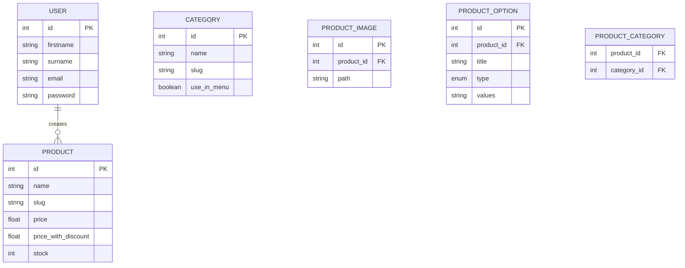

# Projeto Backend API - E-commerce

API RESTful completa para sistema de e-commerce com autenticação JWT, CRUD de produtos, categorias e usuários.

## 📋 Pré-requisitos
- Node.js 18+
- MySQL 8+ ou SQLite (para desenvolvimento)
- npm 9+
- Git

## 🚀 Começando

### Instalação
```bash
git clone https://github.com/JannioFSantos/projectbackend.git
cd projetobackend
npm install
```

### Configuração
1. Copie o arquivo .env.example para .env
```bash
cp .env.example .env
```

2. Configure as variáveis de ambiente no .env

3. Execute as migrações do banco de dados:
```bash
npx sequelize-cli db:migrate
```

4. (Opcional) Popular banco com dados de teste:
```bash
npx sequelize-cli db:seed:all
```

## 🏗️ Estrutura do Banco de Dados

### Diagrama de Entidades


## 🔧 Execução

### Modos de execução
```bash
# Desenvolvimento (com nodemon)
npm run dev

# Produção
npm start

# Testes
npm test

# Testes com watch mode
npm run test:watch
```

## 📚 Documentação da API com Swagger

A documentação interativa da API está disponível via Swagger UI. Após iniciar o servidor, acesse:

```
http://localhost:3000/api-docs
```

### Como usar o Swagger:

1. Inicie o servidor:
```bash
npm run dev
```

2. Acesse http://localhost:3000/api-docs no navegador

3. Para autenticação:
   - Clique no endpoint "/user/token"
   - Clique em "Try it out"
   - Insira email e senha válidos (ex: "admin@test.com" e "test123")
   - Execute e copie o token retornado

4. Para usar endpoints protegidos:
   - Clique no botão "Authorize" no topo
   - Cole o token no formato: "Bearer [SEU_TOKEN]"
   - Agora você pode testar todos endpoints protegidos

5. Teste os endpoints diretamente na interface:
   - Clique em "Try it out" em qualquer endpoint
   - Preencha os parâmetros necessários
   - Execute e veja os resultados

### Exemplo de Uso com cURL

1. Obter token JWT:
```bash
curl -X POST http://localhost:3000/v1/user/token \
  -H "Content-Type: application/json" \
  -d '{"email":"admin@test.com","password":"test123"}'
```

2. Criar novo produto:
```bash
curl -X POST http://localhost:3000/v1/product \
  -H "Authorization: Bearer [SEU_TOKEN]" \
  -H "Content-Type: application/json" \
  -d '{
    "name": "Tênis Esportivo",
    "slug": "tenis-esportivo",
    "price": 299.90,
    "price_with_discount": 249.90,
    "stock": 50,
    "description": "Tênis para corrida",
    "category_ids": [1, 3],
    "images": [
      {
        "type": "image/png",
        "content": "[base64]"
      }
    ],
    "options": [
      {
        "title": "Tamanho",
        "type": "text",
        "values": "38,39,40,41,42"
      }
    ]
  }'
```

## 🛠️ Tecnologias Utilizadas
- Node.js
- Express
- Sequelize (ORM)
- MySQL/SQLite
- JWT (Autenticação)
- Swagger (Documentação)
- Jest (Testes)

## 📝 Licença
Este projeto está licenciado sob a licença MIT - veja o arquivo [LICENSE](LICENSE) para detalhes.

## 👨‍💻 Contribuição
1. Faça um fork do projeto
2. Crie uma branch para sua feature (`git checkout -b feature/AmazingFeature`)
3. Commit suas mudanças (`git commit -m 'Add some AmazingFeature'`)
4. Push para a branch (`git push origin feature/AmazingFeature`)
5. Abra um Pull Request
